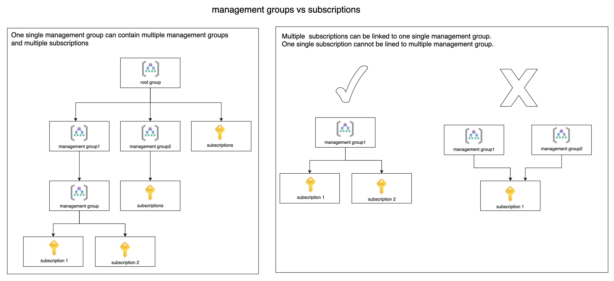
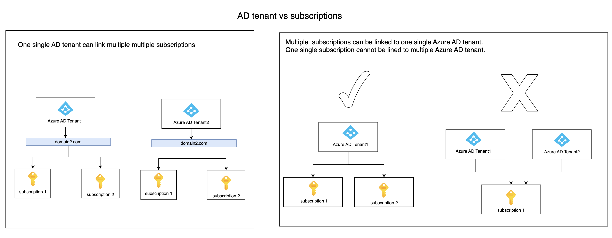
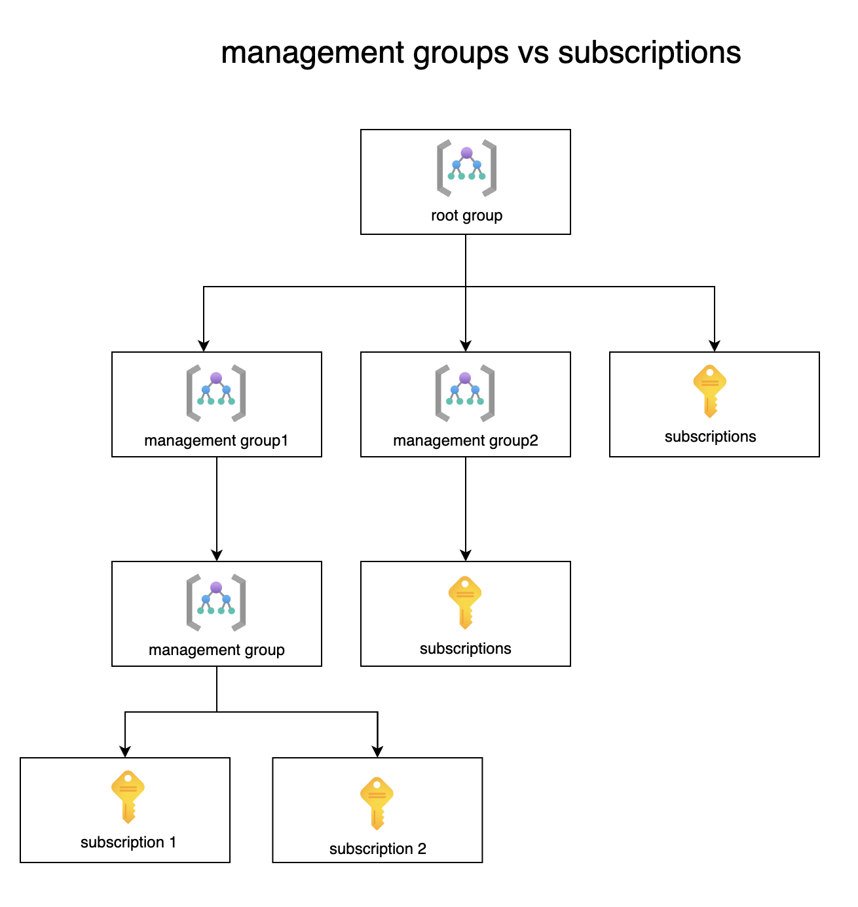
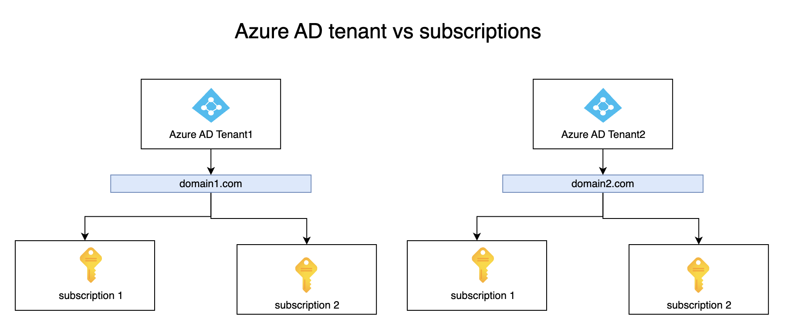

## Azure management group vs Azure subsctiption vs Azure AD tenant
People often gets confused by the hierarchy of Azure management group, Azure Tenant, Azure AD and Azure Subscription.
Let my simplify it.
 
When an Azure account is created, it automatically generates one root management group and one Azure Active Directory tenant by default.

#### Management group vs subscriptions

#### Azure AD tenant vs subscriptions. 

#### Azure AD tenant vs management group
It's important to clarify that while multiple subscriptions can be associated with one Azure AD tenant, there is no direct or inherent relationship between Azure Management Groups and Azure AD tenants.

#### AD users vs Azure AD tenant
In Azure Active directory, one user become a member of one AD tenant which termed as home tenant and the same user can be invited as a guest user to other AD tenants but cannot be direct membership to multiple AD tenants. 

#### Best practice
All subscription in single management group must trust one AD tenant better management, though multiple subscription across management groups could be linked to one Azure AD tenant.

